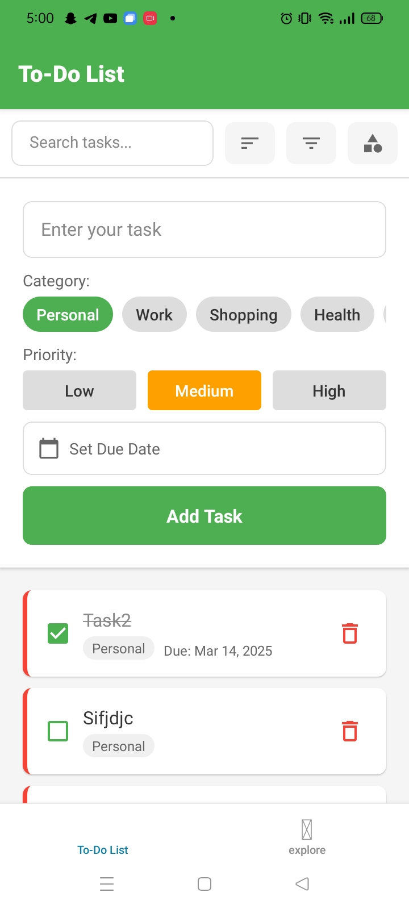
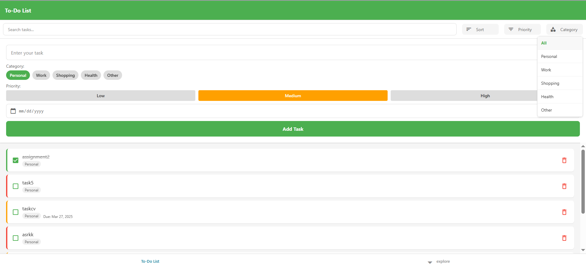

# 📝 ToDo List App

A modern, feature-rich ToDo List application built with React Native and Expo, designed to help users manage their tasks efficiently with advanced categorization, priority management, and filtering capabilities.

## 📱 App Preview

### 📱 Android Version
<div align="center">
  
</div>

### 🌐 Web Version
<div align="center">
  
</div>

## ✨ Features

- **Task Management**
  - Create, edit, and delete tasks
  - Mark tasks as completed
  - Set task priorities (Low, Medium, High)
  - Set due dates for tasks

- **Organization**
  - Categorize tasks into:
    - Personal
    - Work
    - Shopping
    - Health
    - Other

- **Smart Features**
  - Search functionality for quick task finding
  - Filter tasks by priority and category
  - Sort tasks by due date and priority
  - Persistent storage using AsyncStorage

- **Cross-Platform**
  - Works seamlessly on:
    - Web browser
    - Android devices
    - iOS devices
  - Consistent experience across all platforms

## 🎯 Live Demo

Try this project directly in your browser using Expo Snack:
[Open in Expo Snack](https://snack.expo.dev/@rehab_mohamed/todolist_rehab?platform=android)

## 🚀 Getting Started

### Prerequisites

- Node.js installed on your system
- Expo CLI installed (`npm install -g expo-cli`)
- Expo Go app on your mobile device (for testing)

### Installation

1. Clone the repository
   ```bash
   git clone https://github.com/rehabmohamed2/ToDoListApp.git
   cd ToDoListApp
   ```

2. Install dependencies
   ```bash
   npm install
   ```

3. Start the development server
   ```bash
   npx expo start
   ```

## 📱 How to Run

After starting the development server, you have several options to run the app:

- Scan the QR code with Expo Go (Android) or Camera app (iOS)
- Press 'a' for Android emulator
- Press 'i' for iOS simulator
- Press 'w' for web browser

## 🛠️ Built With

- [React Native](https://reactnative.dev/) - The mobile framework
- [Expo](https://expo.dev/) - Development platform
- [AsyncStorage](https://react-native-async-storage.github.io/async-storage/) - Data persistence

## 📄 License

This project is licensed under the MIT License - see the LICENSE file for details.

## 🤝 Contributing

Contributions are welcome! Feel free to submit a Pull Request.

## 📞 Contact

Rehab Mohamed - [GitHub Profile](https://github.com/rehabmohamed2)

Project Link: [https://github.com/rehabmohamed2/ToDoListApp](https://github.com/rehabmohamed2/ToDoListApp)

---
Made with ❤️ using React Native & Expo
